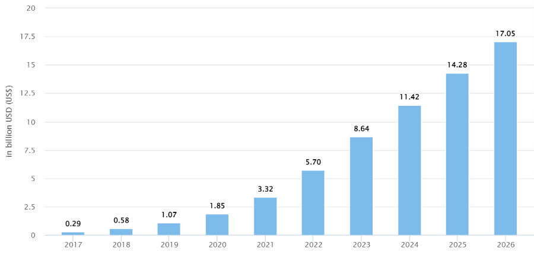
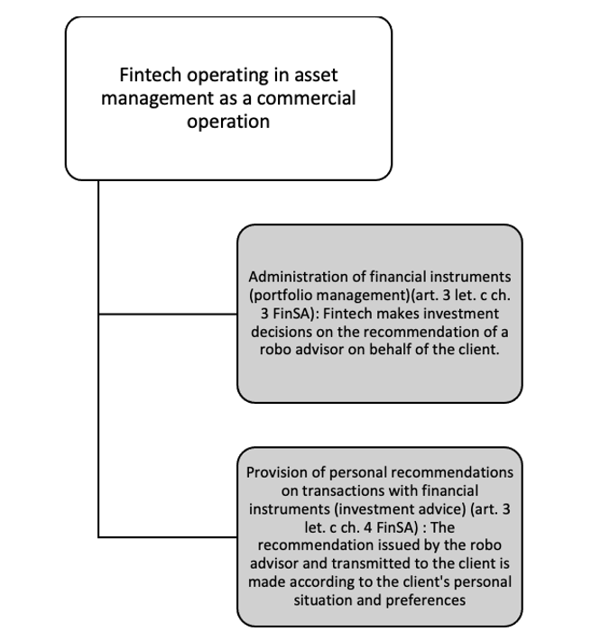
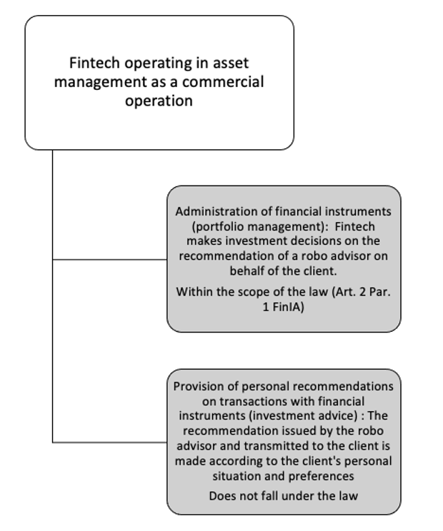

# A.I. in FinTech: A Robo-Advisory Case Study

> *"One of the hottest trends to emerge in [wealth management] is the use of robo-advisors."*
>
> -- Kent Smetters, Chair Professor at UPenn’s Wharton School


Robo-advisors are purely digital portfolio management strategies^[@Dietrich2020 , p. 6.] based on A.I. technology. The investment strategy is constructed based on client information and an investment algorithm, a set of predetermined rules created by investment professionals^[“Robo Advisors in Switzerland: The Ultimate Guide”, accessed 29 April 2022, https://inyova.ch/en/expertise/robo-advisor-switzerland-ultimate-guide/.]. By exploiting this client data, the robo-advisor ensures that the portfolio is one that best fits its owner’s investment capacity, risk tolerance and ambitions. The algorithm drives the financial planning without human supervision^[“The Rise Of Robo Advisors In Wealth Management”, accessed 29 April 2022, https://blog.britech.global/en/the-rise-of-robo-advisors-in-wealth-management.]. 

The first robo-advisor was launched by Betterment^[“Robo-Advisor”, accessed 10 May 2022, https://www.investopedia.com/terms/r/roboadvisor-roboadviser.asp#:~:text=The%20first%20robo%2Dadvisor%2C%20Betterment,through%20a%20simple%20online%20interface.] in 2008 and since then, the industry has been increasingly growing. Until then, a financial advisor stood in the way between clients and automated portfolio allocation software, which has now, through the robo-advisory business model, been democratized. Indeed, robo-advisors are less expensive than traditional “human” advisors and can take on clients with much humbler means^[“The Rise of the Robo-advisor: How FinTech Is Disrupting Retirement”, accessed 10 May 2022, https://knowledge.wharton.upenn.edu/article/rise-robo-advisor-FinTech-disrupting-retirement/.]. Inyova, a Swiss impact-investment firm, takes on robo-advisory clients for as little as CHF 2’000. These lower costs and lower fees are enabled by the automated investment strategies and auto-rebalancing of asset-allocations^[“The Rise of The Robo-Advisor In Wealth Management”, accessed 10 May 2022, https://www.wipro.com/digital/rise-robo-advisor-wealth-management0/.], which, once the algorithm is finalized, require minimal human intervention. 

In Switzerland, robo-advisory has seen consistent growth since 2017. Statista estimates current Assets under management^[AUM is the total market value of the investments that a person or entity manages on behalf of clients:  “Asset Under Management (AUM)”, accessed 6 May 2022, https://www.investopedia.com/terms/a/aum.asp .] (AUM) at USD 5.7 billion, and projected to hike to USD 17.5 billion by 2026.  In addition, AUM are expected to show an annual growth rate between 2022 and 2026 of 31.13% resulting in a projected total amount of USD 17.32 billion by 2026^[“Robo-advisors”, accessed 6 May 2022, https://www.statista.com/outlook/dmo/FinTech/digital-investment/robo-advisors/switzerland.]. 

{width=70%}

*Figure 5*^[Source: “Robo-advisors”, accessed 6 May 2022, https://www.statista.com/outlook/dmo/FinTech/digital-investment/robo-advisors/switzerland.]


## Robo-Advisory Regulation, Recent Developments

In this subchapter, we explore recent developments in financial markets law and their applications to  robo-advisory. 

### FinSA

The FinSA came into force on January 1, 2020. The law primarily regulates how financial services must be provided and how financial instruments must be offered. As such, wealth managers, wealtechs and robo-advisors are directly impacted by its introduction. It is a comprehension revision and expansion of the supervisory regime under financial market law, with a drive for standardization: “same business, same rules”^[@Fausch2020 , p. 14.]. 

According to Art. 1 Par. 1 FinSA “this Act seeks to protect the clients of financial service providers and to establish comparable conditions for the provision of financial services by financial service providers, and thus contributes to enhancing the reputation and competitiveness of Switzerland's financial centre.”
Thus three purposes emerge from the text of the law: 

1. To protect the clients (who are all creditors, investors and policyholders to whom a financial service provider provides such services^[FG 2015 8140.])

2. To establish comparable conditions for the provision of financial services. And thus create a level playing field for financial service providers^[@Vogel2020 , N 19 ad art. 1 FinSA.] 

3. strengthening the reputation and competitiveness of the Swiss financial center

Pursuant to Art. 2 FinSA, the following are subject to this Act, regardless of their legal form: financial service providers, client advisers, and producers and providers of financial instruments. FinTechs are considered to be financial service providers in the sense of FinSA because they are natural or legal persons who provide financial services on a commercial basis in Switzerland or for clients in Switzerland (Art. 3 Let. d FinSA). The criterion of a commercial basis is satisfied if there is an independent economic activity pursued on a permanent, for-profit basis (Art. 3 Let. d FinSA). Therefore, FinSA is applicable for FinTechs, and A.I.-based robo-advisors in particular^[@Favrod2021 , p. 207]. However, it is essential to be aware of the fact that “companies or units of a group which provide financial services for other companies or units of the same group are not deemed to be financial service providers within the meaning of Art. 3 Let. d FinSA” (Art. 3 Par. 4 FinSO^[Ordinance on Financial Services of June 6th, 2019 (“FinSO”; CC 950.11.)]). FinTechs operating in asset management can be represented by the following figure: 

{width=60%}

*Figure 6*^[Source: own illustration]

Therefore, robo-advisors are considered to be financial service providers since they provide portfolio management services or, more rarely, investment advice^[@Hirsch2022 , p.35.]. 

The application of the FinSA does not require the FinTech company to obtain an authorization from the FINMA^[@Favrod2021 , p. 209]. However, FinTech must now comply with several legal requirements before starting their activity, at the risk of being subject to criminal sanctions (Art. 89 *et seq.* FinSA). 

#### Consequences of the Application of FinSA: through the lens of Robo-Advisory

**Client Segmentation**, Art. 4 FinSA. Financial service providers must carry out a segmentation of their clients by classifying the persons who they provide such services to. The categories for segmentation are provided by the law: retail clients (Par. 2), professional clients (Par. 3) and institutional clients (al. 4). 

* In Art. 4 Par. 2 FinSA, retail clients are defined in the negative as clients who are not professionals. 

* In Art. 4 Par. 3 FinSA, professional clients are defined as “financial intermediaries as defined in the BA^[, the FinIA and the CISA; insurance companies as defined in the ISA; foreign clients subject to prudential supervision as the persons listed under a and b above; central banks; public entities with professional treasury operations; occupational pension schemes with professional treasury operations and other occupational pension institutions providing professional treasury operations; companies with professional treasury operations; large companies; private investment structures with professional treasury operations created for high-net-worth retail clients”

* In Art. 4 Par. 4 FinSA, institutional clients are defined as financial intermediaries as defined in the BA, the FinIA and the CISA^[Federal Act on Collective Investment Schemes of June 23rd, 2006 (“CISA”, CC 951.31).] ; insurance companies as defined in the ISA; foreign clients subject to prudential supervision as the persons listed under Let. a and b above and central banks as well as national and supranational public entities with professional treasury operations.

Par. 7 of this provision provides for the possibility for financial service providers to waive the segmentation if they treat all their clients as retail clients.

The segmentation system provided for in Art. 4 FinSA is not fixed^[@Favrod2021 , p. 210]. Indeed, under certain conditions provided for in Art. 5 FinSA, clients can change their status.

**Information Duties**, Art. 8 and 9 FinSA; Art. 6 *et seq.* FinSO. The service provider must comply with an information obligation. According to Art. 8 FinSA, the company must inform the client about itself and its financial services as well as about the associated risks. In particular, based on Art. 7 Par. 1 FinSO, the robo-advisor also has a duty to actively inform the customer about how robo-advisors work and  the client must be informed about the objectives, the risks and the benefits of the robo-advisor. Likewise, in accordance with the same Article, the client must know that the investment decisions are based on algorithms that use the information provided by the client in the questionnaire during the onboarding process.			

Following the recommendation of @Hirsch2022 , it is also certainly advisable that robo-advisors inform their clients that under certain conditions human intervention would be possible, for rebalancing the individual positions in the portfolio, such as in times of recessions and financial downturns^[@Hirsch2022 , pp. 38-39.]. If robo-advisors use not only traditional algorithms but also machine learning, @Hirsch2022 believes that the client should be informed about this as well^[@Hirsch2022 , p. 38.] 


> The information requirements (Art. 8 FinSA) aim to provide customers with a comprehensive overview of the services offered by the robo-advisor. The information can be provided on paper or electronically (Art. 9 Par. 3 FinSA).

**Establishment of Client Profile**, Art. 12 FinSA; Art. 16 and 17 FinSO. In order to carry out the suitability test according to Art. 12 FinSA, the company must gather sufficient information about the client to create a client profile^[@Stengel2020 , p. 404]. Art. 12 FinSA further defines that the robo-advisor must obtain information about the client's prior knowledge and experience, income, overall financial situation, financial goals, investment horizon and risk tolerance. In practice, this means that the client must be provided with an appropriately designed questionnaire. The robo-advisor then creates the client profile based on the client's answers from the aforementioned questionnaire. The questionnaire must capture the information necessary to assess the suitability of an investment strategy^[@Hirsch2022, p. 37]. To do this, an algorithm is created that assigns the client to one of, for example, five categories based on a flying score for each individual answer to each question. The algorithm must separately assign the customer a score for two different categories: Risk Ability and Risk Preference. Therefore, when assigning points, it is important that the algorithm pays attention to whether the particular question counts toward risk capacity, which is based on the customer's income and asset situation, or toward risk preference. It is also important that the algorithm does not allow risk overload. This would be the case if the risk appetite is higher than the risk capacity. In this particular instance, the risk capacity score must be used and the customer must be placed in the corresponding category. In 
this context, the quality of the questionnaire, the coherence of the information and the appropriate processing of the information must be ensured, as there should be no human intervention at this stage^[@Hirsch2022 , pp. 34-35.].

Based on the information provided by the client, the robo-advisor then proposes an investment strategy and also performs a suitability check (Art. 17 Par. 3 FinSO, Art. 13 and 14 FinSA). Art. 13 FinSA provides for an exemption from the verification obligation. If the services are limited to the execution or transmission of client orders, financial service providers are not obligated to perform an appropriateness or suitability assessment. ​​Art. 14 FinSA regulates non-assessability or lack of appropriateness or suitability. Thus, the financial service provider must inform before providing the service that he is not in a position to make the assessment, if he does not have the information necessary to assess the appropriateness or suitability (Par. 1). If, however, he has the information and believes that a financial instrument is not appropriate or suitable for the client, he must advise the client against it before providing the service (Par. 2).

> Matter of appropriateness (Art. 10 *et seq.* FinSA, Art. 16 *et seq.* FinSO.): When providing portfolio management services or investment advice considering the client's entire portfolio, the firm must inquire about the client's financial situation and investment objectives, as well as the client's knowledge and experience. 

**Documentation and Rendering of the Account**, Art. 15 and 16 FinSA; Art. 18 and 19 FinSO. Art. 15 Par. 1 FinSA implies the following duties for the provider to document in an appropriate manner the financial services agreed with clients and the information collected about them (Let. a), the notification described in Art. 13 Par. 2 FinSA or the fact that they advised the clients in accordance with Art. 14 FinSA against availing of the service (Let. b) and the financial services provided for clients (Let. c). 

If so requested, financial service providers shall provide their clients with a copy of the documentation mentioned in Art. 15 FinSA or shall make it accessible to them in another appropriate manner (Art. 16 Par. 1 FinSA). Moreover, the Par. 2 provides that, at the clients' request, they shall render account of the financial services agreed and provided (Let. a), the composition, valuation and development of the portfolio (Let. b) and the costs associated with the financial services (Let. c).

In addition, according to Art. 18 FinSO, the robo-advisor must be able to account to a client within ten business days of the client requesting their documentation. Furthermore, all documentation must be retained for at least ten years (Art. 18 FinSO). 

> Among other things, the FinSA requires firms to record the information collected from clients and the services agreed with and provided to them and the results of suitability and appropriateness reviews(Art. 15 *et seq.*, FinSA.).

**Other requirements**. The financial service provider has an obligation to respect the principles of transparency and diligence regarding client orders (Art. 17 FinSA and 20 FinSO ; Art. 18 FinSA and 21 *et seq.* FinSO). Moreover, ​​the financial service provider must comply with the organizational requirements set out in Art. 21 *et seq.* FinSA.

### FinIA

The FinIA does not contain any specific rules regarding FinTech. This implies that the conditions of application are the same for all regardless of the technology used (principle of innovative-neutrality). 

FinIA’s objective, according to Art. 1 Par. 2 FinIA,“ is to protect the investors and clients of financial institutions and ensure the proper functioning of the financial market”. On reading this provision, one can see that a further purpose is to regulate uniformly the requirements imposed on financial institutions who invest and manage the assets of others in the conduct of their business^[FG 2015 8214.; @Favrod2021 , p. 179.].

Pursuant to art. 2 Par. 1 FinIA, the law regulates 5 types of financial institutions which are the following : portfolio managers ; trustees ; managers of collective assets ; fund management companies ; securities firms. Paragraph 2 lists the persons excluded from the scope of the law. 

Therefore, to examine the application of the FinIA for Fintech operating in asset management as a commercial operation, it is necessary to distinguish between portfolio management and investment advice. Indeed, only the portfolio managers are subject to the FinIA (Art. 12 Par. 1 Let. a FinIA)^[@Hirsch2022, p.36.; @Favrod2021 , pp. 185-186.]. This way, FinTechs operating in asset management can be represented by the following figure: 

{width=60%}

*Figure 7*^[Source: own illustration]

If FinTech operates a robo advisor that directly makes an investment decision resulting from the advice given by the algorithm, it is considered to be an asset manager within the meaning of Art. 17 FinIA. In this case the law applies if the FinTech acts in a professional way and not in a private way (see Art. 19 Par. 1 FinIO^[Ordinance on Financial Institutions of November 6th, 2019 ("FinIO"; CC 954.11)]), which is generally the case ^[@Favrod2021 , pp. 185-186.].

The consequence of falling under this law is that portfolio managers are required to obtain a license form FINMA since they are financial institutions (Art. 5 Par. 1 FinIA). However, robo-advisors that only provide investment advice must enter the register of advisors (Art. 28 *et seq.* FinSA) but they are not required to obtain a license and/or prudential supervision ^[@Hirsch2022 , p. 36.]. If a license is required, portfolio managers (and trustees) must be subject to a supervisory organisation in accordance with Art. 43a FINMASA and must be able to provide proof of this in order to apply for a license (Art. 7 (2) FinIA).
Art. 6 FinIA provides a cascading authorisation that allows a company, which has a more restrictive type of authorization to obtain, to carry out the authorized activities under more flexible conditions ^[@Favrod2021 , p. 187.]. Thus, “authorisation to operate as a manager of collective assets also authorises an entity to operate as a portfolio manager” (Art. 6 (4) FinIA). The FinTech will have to respect all the obligations that result from these cascading authorizations^[FG 2015 2818.]. The conditions of authorization are found in Art. 7 *et seq.* FinIA and 17 *et seq.* FinIA. 

### FADP

From September 2023, the new revised Swiss Federal Act on Data Protection (FADP) will come into force with important provisions governing the processing of personal data. The FADP’s main objective is to strengthen data subjects’ self-determination in relation to their data. The FADP is largely based on the General Data Protection Regulation (GDPR), which has been adopted by the EU and has been in effect since 25 May 2018^[“What does the revision of the Swiss Data Protection Act entail, and how does it relate to the GDPR and the ePrivacy Regulation?”, accessed 4 May 2022, https://www.pwc.ch/en/publications/2018/Swiss-Federal-Protection-Act.pdf.].
 
The FADP is crucial for Swiss FinTech startups, especially for WealthTech Small and Medium-sized Enterprises (SMEs) since their operations are data-heavy. In the case of robo-advisory, questionnaires and investment decisions are made online which raises several data protection concerns regarding these automated portfolio management services called ‘Automated Individual Decision-Making (ADM)’. ADM, which already was featured in the GDPR, is one of the new concepts that is included in the FADP. Unlike the GDPR, the FADP does not provide for a general obligation to obtain consent. Such an obligation is only imposed for high-risk profiling.^[“New Data Protection Act: What do Swiss companies need to be aware of?”, accessed 5 May, 2022, https://www.axa.ch/en/unternehmenskunden/blog/security-and-legal/law-and-justice/new-data-protection-act.html.]. 
Under Swiss and European law (Art. 22 GDPR; Art. 21 FADP), ADM is deemed to exist if the following three conditions are met:

a. It must be an individualized decision;
b. The decision must be made without any human involvement (‘based solely on automated processing’);
c. The decision must produce legal effects concerning the data subject or similarly significantly affect her.

Considering the typical robo-advisor’s onboarding process, these three conditions are met, since it handles (1) one client per process, (2) there is no human intervention, and (3) each investment decision made by an algorithm consists in selling or buying financial instruments in the name and on behalf of the client^[@Hirsch2022 , p.42].

GDPR prohibits ADM by stating that any “data subject shall have the right not to be subject to a decision based solely on automated processing, including profiling” [@Hirsch2022 , p.41]. Unlike GDPR, Swiss law does not prohibit ADM, and only imposes appropriate safeguards and the duty to inform the data subject [@Hirsch2022 , p.44]. Under the FADP, no "legal basis" (so-called "justification", i.e. the Swiss equivalent of the European legal basis under Art. 6 and 9 GDPR) is in principle required to lawfully process personal data. Thus, a justification is only required if the processing of personal data results in a violation of the personality of the data subjects (Art. 30 Par. 2 FADP). 
The most notable difference between FADP and GDPR is that FADP treats the process of the profile differently by the intensity of risk. Under the FADP, a valid consent is one that is given voluntarily upon provision of adequate information ("informed consent"). It is effective if it was given prior to the processing. However, the implied consent does not apply to sensitive 

personal data or profiling "involving a high risk" (i.e. profiling that results in a personality profile and carries a high risk of negative consequences for the data subject)^[“Swiss revDPA: Comparison with the GDPR”, accessed 4 May 2022, https://www.vischer.com/fileadmin/uploads/vischer/Documents/Diverses/210526_VISCHER_New_Swiss_DPA_-_Comparison_with_the_GDPR__Version_1.01_.pdf.] . 

In our interview, both startups (Relai AG and Descartes AG) outsource client data storage or general data management. According to Julian Liniger, the CEO of Relai AG, since data storage of FinTech SMEs is easy to be audited, RegTech (Regulation + Technology) startups (e.g. Know Your Customer (KYC)Spider) help to keep the onboarding process and KYC process as lean as possible. Descartes AG also would like to focus on their primary business, client services, by outsourcing cloud data services to the RegTech firm.

## Case Study: A.I.-driven Processes
Robo-advisors differ by institution, based on their underlying algorithm. However, their implementation steps are consistently the same. Clients first complete a questionnaire to assess risk tolerance, investment ambition and needs. Based on this information, the robo-advisor builds a diversified portfolio based on an algorithm, a set of predefined rules, created by investment professionals. These investment professionals monitor market signals and ensure that the algorithm is rebalancing the portfolio appropriately^[“Robo-Advisors: An Introduction”, accessed 4 May 2022, https://www.schwab.com/automated-investing/what-is-a-robo-advisor]. 

We have created a Python pseudocode to illustrate the mechanism by which the robo-advisor categorizes the client, assigns a portfolio and rebalances it. Note that we have only used a very naive questionnaire, which in reality would not comply with the revised FinSA, as we do not distinguish between risk capacity and risk preference. This step would be needed to prevent any risk oversteering. In practice, this may be done by using the lowest score between risk capacity and preference for the final risk category assignment. The AI-portfolio attribution process has been highly simplified, with investment strategies consisting of simple bond to equity ratios. 

### Risk categories
First, 5 risk categories are defined. Each one corresponds to an investment strategy that the client will be assigned to by the robo-advisor. 
```{python eval=FALSE}
# Defining risk categories
def investment_recommendation():
    risk_levels = {
            'Conservative': '80% bonds, 20% equities',
            'Balanced': '60% bonds, 40% equities',
            'Growth': '40% bonds, 60% equities',
            'Opportunistic': '20% bonds, 80% equities',
            'All Equity': '0% bonds, 100% equities',      
    }   
```

### Questionnaire
Current trends in the robo-advisory industry show questionnaires are generally being shortened to make robo-advisory solutions more attractive to new clients. However, enough questions need to be asked to correctly identify the client’s risk capacity and risk preference and to comply with regulations such as the FinSA. For simplicity, we have included 10 questions in the following pseudocode, which are inspired by several leading Swiss robo-advisors^[We looked at the questionnaire of, among others, Descartes Finance AG, True Wealth and Inyova].

```{python eval=FALSE}
# Questions
class risk_profile:
    
    q1 = ("1. Please enter your age", 
    choices = [
      ('0', 'More than 60'),
      ('2', 'Between 51 and 60'), 
      ('5', 'Between 41 and 50'), 
      ('8', 'Between 31 and 40'), 
      ('10', '30 or younger')])
    q2 = ("2. What is your investment horizon?", choices = [
      ('0', 'Within the next year'), 
      ('2', '2 - 5 years'), 
      ('5', '5 - 10 years'), 
      ('8', '10 - 20 years'), 
      ('10', 'More than 20 years')])
    q3 = ("3. If you were to lose your job, how long would you be able to finance your current living?", 
    choices = [
      ('0', '1 week'), 
      ('2', '1 month'), 
      ('5', '3 months'), 
      ('8', '6 months or more'), 
      ('10', 'I am already retired')])
    q4 = ("4. What is your total annual income?", choices = [
      ('0', 'Less than CHF 50,000'), 
      ('2', 'CHF 50,000 - CHF 100,000'), 
      ('5', 'CHF 100,000 - CHF 150,000'), 
      ('8', 'CHF 150,000 - CHF 250,000'), 
      ('10', 'More than CHF 250,000')])
    q5 = ("5. How is the stability of your income", 
    choices = [
      ('0', 'Low'), 
      ('2', 'Below average'), 
      ('5', 'Average'), 
      ('8', 'Above Average'), 
      ('10', 'Very Stable')])
    q6 = ("6. If you would receive CHF 20,000 today, what would you do?", 
    choices = [
      ('0', 'Deposit it in bank account'), 
      ('2', 'Invest only in safe bonds'), 
      ('5', 'Invest in a mix of bonds and stocks'), 
      ('8', 'Invest only in stockss'), 
      ('10', 'Buy a new car')])
    q7 = ("7. When you think of the word “risk” in a financial context, which of the following words come to mind?", 
    choices = [
      ('0', 'Loss'), 
      ('2', 'Dangerous'), 
      ('5', 'Uncertainty'), 
      ('8', 'Opportunity'), 
      ('10', 'Thrill')])
    q8 = ("8. Which of the following statements would best describe your attitude regarding investing?", 
    choices = [
      ('0', "I need to see a little return"), 
      ('2', "I would have a hard time tolerating any losses"), 
      ('5', "I can tolerate a small loss"), 
      ('8', "I can tolerate a loss"), 
      ('10', "I don't mind a loss at all")])
    q9 = ("9. Throughout the 2009 financial crisis, the SMI lost 50% of its value. Which of the following would you have done if your portfolio experiences a 50% loss?", 
    choices = [
      ('0', 'Sell all investments'), 
      ('2', "Move all investments into bonds"), 
      ('5', 'Change to a more conservative allocation'), 
      ('8', 'Hold on to investments'), 
      ('10', "Investeven  more")]) 
    q10 = ("10. As return increases so does risk. Which statement applies to you?", 
    choices = [
      ('0', "I am not willing to accept any fluctuations in value"), 
      ('2', "I can live with fluctuations between 0% to 5%"), 
      ('5', "Value fluctuations between 5% and 10% are fine"), 
      ('8', "I can accept fluctuations between 10% and 20%"), 
      ('10', "Even fluctuations over 20% are fine for me")])
```

### Point distribution
After collecting the relevant client information and attributing a score, the robo-advisor classifies the customer into one of five risk categories. 
```{python eval=FALSE}
# Traditional Risk Profile 
def new_risk_profile():
    form = risk_profile()

    if Sum < 20:
        risk_profile = "Conservative"
    elif Sum >= 20 and Sum < 40:
        risk_profile = "Balanced"
    elif Sum >= 40 and Sum < 60:
        risk_profile = "Growth"
    elif Sum >= 60 and Sum <= 80:
        risk_profile = "Opportunistic"
    else:
        risk_profile = "All Equity"
        
    return result
```

### Portfolio Recommendation
In this next step, the robo-advisor makes an investment strategy. Two requirements are added: first, the client must be at least 18 years old and not yet retired to become a client with our company. Second, the minimum investment amount is CHF 2,000; in line with Inyova. We have also added a small feature that allows the algorithm to automatically combine our recommended investment portfolio if the above two requirements are met. One should note that these investment strategies are, in practice, the fruit of careful optimization algorithms based on (in the case of Switzerland) stocks which are listed on the Swiss Market Index (SMI) and bonds and/or an exchange-traded funds (ETF). 
```{python eval=FALSE}
# Final Recommendation
def portfolio_recommendation():

    first_name = ["First_Name"]
    age = ["Age"]
    investment_amount = ["Investment_Amount"]

    if age < 18:
        return build_validation_result("You need to be at least 18 years old to use our service")
    elif age >= 65:
        return build_validation_result("You must not be retired yet")
       
    if investment_amount < 5000:
        return build_validation_result("The minimum investment amount is CHF 5'000")
    
```


### Rebalancing
Finally, we come to portfolio rebalancing. In order to keep the risk level chosen by the client constant, the algorithm of the following pseudo-code^[This pseudo-code is inspired by Github user **siavashadpey**, accessible through following link: https://github.com/siavashadpey/rebalance] must periodically adjust the allocation of each position within the investment portfolio. Starting from a predefined allocation overview of all components of the investment portfolio, the algorithm will check whether the actual allocation in the portfolio still matches the target allocation. Deviations occur simply due to stock price increases/decreases. If discrepancies exist, either automated purchases or sales of the stocks are ordered. 

```{python eval=FALSE}
# Define target portfolio
target_portfolio = {
    "AAPL": 30.00,
    "IBM": 40.00,
    "AMZN": 25.00,
    "Cash": 5.00
}

# Define example portfolio which needs to be rebalanced
portfolio = {
    "AAPL": 40.00,
    "IBM": 35.00,
    "AMZN": 20.00,
    "CASH": 5.00
}

# Set tolerance value in %
tolerance = 5.00

# Iterate over all stocks in our current portfolio
for i in portfolio:
    # Calculate the total value of our portfolio (including cash)
    if i == Cash:
        total_value += portfolio[i]
        continue
    total_value += price * portfolio[i]

# Record which stocks need to be rebalanced
rebalance_needed = dict()
for i in target_portfolio:

    # Rebalance needed if: difference between example and target portfolio is greater than tolerance
    difference = ((prices[i] * portfolio[i]) / total_value) - target_portfolio[i]
      if (difference) > tolerance:
          rebalance_needed[i] = difference

# Now we can rebalance the portfolio
while rebalance_needed:
    quantity = int((target_portfolio[ticker] * (total_value / prices[ticker])) - portfolio[ticker])
```


